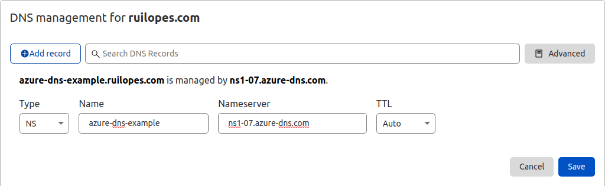
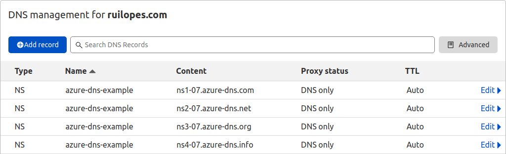

# About

This shows how to manage a DNS domain using Azure DNS and how to configure a parent DNS zone domain delegation.

This example domain will point to an example application using a Let's Encrypt TLS Certificate akin to the example at [rgl/terraform-azure-container-instances-vagrant](https://github.com/rgl/terraform-azure-container-instances-vagrant).

This is wrapped in a vagrant environment to make it easier to play with this stack without changing your local machine.

## Usage

If you are using Hyper-V, [configure Hyper-V in your local machine](https://github.com/rgl/windows-vagrant#hyper-v-usage).

If you are using libvirt, you should already known what to do.

Define the delegated dns zone name in the `dns_zone` variable at the `main.tf` file.

Start the vagrant environment:

```bash
vagrant up --no-destroy-on-error
```

Enter the created vagrant environment:

```bash
# enter the vagrant environment.
vagrant ssh

# login into azure.
az login

# list the subscriptions and select the current one
# if the default is not OK.
az account list --all
az account show
az account set --subscription <YOUR-SUBSCRIPTION-ID>

# provision the example infrastructure.
cd /vagrant
export CHECKPOINT_DISABLE=1
export TF_LOG=TRACE
export TF_LOG_PATH=terraform.log
terraform init
terraform plan -out=tfplan
time terraform apply tfplan
```

Create the parent DNS zone delegation with the Azure DNS name servers.

For that, first list the Azure DNS name servers:

```bash
terraform output -json dns_name_servers | jq -r '.[]'
```

This should return:

```
ns1-07.azure-dns.com.
ns2-07.azure-dns.net.
ns3-07.azure-dns.org.
ns4-07.azure-dns.info.
```

Then, at your parent DNS name server, create the DNS zone delegation by creating the following DNS Resource Records:

```
azure-dns-example NS ns1-07.azure-dns.com.
azure-dns-example NS ns2-07.azure-dns.net.
azure-dns-example NS ns3-07.azure-dns.org.
azure-dns-example NS ns4-07.azure-dns.info.
```

For example, using the Cloudflare DNS managment, this will look like:




Check the DNS resolution directly against the first Azure DNS name server:

```bash
ns="$(terraform output -json dns_name_servers | jq -r '.[0]')"
fqdn="$(terraform output -raw fqdn)"
dig $fqdn a @$ns
```

This should return something like:

```
;; ANSWER SECTION:
test.azure-dns-example.ruilopes.com. 300 IN CNAME 64fb370837ff526e978d67ecc2bd2669.francecentral.azurecontainer.io.
```

Repeat the process, but using your network DNS resolver:

```bash
dig $fqdn a
```

**NB** It might take a few minutes (due to propagation/caching) until it returns anything.

This should return something like:

```
;; ANSWER SECTION:
test.azure-dns-example.ruilopes.com.                              269 IN CNAME 64fb370837ff526e978d67ecc2bd2669.francecentral.azurecontainer.io.
64fb370837ff526e978d67ecc2bd2669.francecentral.azurecontainer.io. 276 IN A     51.11.236.146
```

Use the example application (which uses a domain from the delegated DNS zone):

```bash
wget -qSO- "$(terraform output -raw url)"
```

Destroy the infrastructure:

```bash
terraform destroy
```

And remove the DNS zone delegation from the parent domain.
